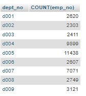

# MDS-2526-B3-DW-SQL

## Liens utiles

- `https://sql.sh` : cours global pour les requêtes
- `https://github.com/Microleadoff/database-installer-py` : lien de l'installateur des 4 BDD en python

### Ordre des mots-clés dans une requête

```sql
SELECT *
FROM table
WHERE condition
GROUP BY expression
HAVING condition
{ UNION | INTERSECT | EXCEPT }
ORDER BY expression
LIMIT count
OFFSET start
```

### Description des instructions

- `SELECT DISCINCT` : supprime les doublons
- `WHERE` : permet de poser une condition - filtrer les résultats. Les opérateurs possibles utilisables avec la clause WHERE :

| Opérateur  | Description                                                       |
|------------|-------------------------------------------------------------------|
| =          | Égale                                                             |
| <>         | Pas égale                                                         |
| !=         | Pas égale                                                         |
| >          | Supérieur à                                                       |
| <          | Inférieur à                                                       |
| >=         | Supérieur ou égale à                                              |
| <=         | Inférieur ou égale à                                              |
| IN         | Liste de plusieurs valeurs possibles                              |
| BETWEEN    | Valeur comprise dans un intervalle donnée (utile pour les nombres ou dates) |
| LIKE       | Recherche en spécifiant le début, milieu ou fin d'un mot          |
| IS NULL    | Valeur est nulle                                                  |
| IS NOT NULL| Valeur n'est pas nulle                                            |

-  `WHERE ... AND ...` : Permet d'ajouter plusieurs conditions 
-  `WHERE ... OR ...` : Permet d'ajouter plusieurs conditions optionnelles
-  `WHERE ... IN ...` : Permet de filtrer sur une liste d'éléments
-  `WHERE ... BETWEEN ...` : Permet de filtrer entre 2 valeurs
-  `WHERE ... IS NULL ...` : Permet de filtrer sur les champs "NULL"
-  `WHERE ... LIKE ...` : Permet de filtrer sur les chaines de caractères. Voici les utilisations possibles

| Modèle        | Description                                                                 | Exemples correspondants       |
|---------------|-----------------------------------------------------------------------------|--------------------------------|
| `LIKE '%a'`   | Recherche toutes les chaînes qui **se terminent par “a”**                   | `pizza`, `salsa`              |
| `LIKE 'a%'`   | Recherche toutes les chaînes qui **commencent par “a”**                     | `avion`, `arbre`              |
| `LIKE '%a%'`  | Recherche toutes les chaînes qui **contiennent “a”**                        | `chat`, `manger`              |
| `LIKE 'pa%on'`| Recherche les chaînes qui **commencent par “pa” et se terminent par “on”**  | `pantalon`, `pardon`          |
| `LIKE 'a_c'`  | Le caractère `_` représente **un seul caractère** (contrairement à `%`)     | `aac`, `abc`, `azc`           |


## Exemples de requetes pour pratique sur la BDD WORLD

- `SELECT DISTINCT state_code FROM cities;` (1185)
- `SELECT * FROM cities WHERE state_code = "07";` (435)
- `SELECT * FROM cities WHERE state_code = "07" AND country_code = "AD";` (0)
- `SELECT * FROM cities WHERE state_code = "07" OR country_code = "AD";` (444)
- `SELECT * FROM cities WHERE latitude > 42 AND longitude > 1.5;` (53085)
- `SELECT * FROM cities WHERE latitude < 20 AND longitude > 50;` (15814)
- `SELECT * FROM cities WHERE latitude > 42 AND longitude > 1.5 OR latitude < 20 AND longitude > 50;` (68899)
- `SELECT * FROM cities WHERE (latitude > 42 AND longitude > 1.5) OR (latitude < 20 AND longitude > 50);` (68899)
- `SELECT * FROM cities WHERE country_code IN ("AD", "AE");` (49)
- `SELECT * FROM cities WHERE latitude BETWEEN 20 AND 30;` (10235)
- `SELECT * FROM countries WHERE wikiDataId IS NULL;` (47)
- `SELECT * FROM countries WHERE wikiDataId IS NOT NULL;` (203)
- `SELECT * FROM cities WHERE name LIKE 'a%';` (9002)
- `SELECT * FROM cities WHERE name LIKE '%a';` (25624)
- `SELECT * FROM cities WHERE name LIKE '%zw%';` (76)
- `SELECT * FROM cities WHERE name LIKE '%c_t%';` (1973)


## TP 1

En individuel, vous allez devoir continuer, ce fichier readme : 

- Vous créez votre propre fichier, a part
- Vous traitez un maximum de cas de figure sur le site sql.sh
- Vous ne faites ni de jointure, ni de procédures stockées, ni de trigger

Vous allez devoir pour chaque instruction que l'on n'a pas vu : 

1. expliquer l'instruction rapidement
2. en vous servant de la base de données "SAKILA", vous allez créer 1 à 3 cas defigure nécessitants une requete. Par exemple :"Récupérer tous les state_code de la table cities sans aucun doublon". Vous devrez ensuite écrire la requete SQL correspondante, par exemple : `SELECT DISTINCT state_code FROM cities;`. Notez le nombre de résultats obtenus par exemple (1185).

## Start

### Group BY

Le group BY permet de trié/regroupé le résultat demandé par colonne
```sql
select title,rating from film GROUP BY rating;
```

### Having

Le having permet de filtrer le résultat du group BY 
```sql
SELECT rating, COUNT(*) AS nb_films
FROM film
GROUP BY rating
HAVING COUNT(*) > 50;
```

### Order By

Le ORDER BY permet de trier les résultats d’une requête selon une ou plusieurs colonnes, dans un ordre croissant ou décroissant
```sql
SELECT title, release_year
FROM film
ORDER BY release_year DESC;
```

### AS

Le AS permet de changer le nom d'une colonne momentannément au moment de l'affichage.

```sql
SELECT title AS Titre, release_year AS AnneeSortie
FROM film
ORDER BY AnneeSortie DESC;
```

###  Limit 

Le limit permet de spécifier le nombre de ligne demandé
```sql
SELECT title AS Titre, release_year AS AnneeSortie
FROM film
limit 10;
```

### Case

le case permet de faire comme un if et de retourner un résultat en fonction de plusieurs conditions
```sql
SELECT title,
       release_year,
       CASE 
           WHEN release_year < 2000 THEN 'Ancien'
           WHEN release_year BETWEEN 2000 AND 2010 THEN 'Moyen'
           ELSE 'Récent'
       END AS categorie
FROM film;
```

### Union

Le Union permet de relier tout les éléments de deux tables en supprimant les doublons
```sql
SELECT title, release_year
FROM film
WHERE release_year < 2000

UNION

SELECT title, release_year
FROM film
WHERE release_year >= 2000;
```

### Except / Minus

permet de récupérer les enregistrements de la première requête sans ceux présents dans la deuxième requête

```sql
SELECT nom
FROM etudiants

MINUS

SELECT nom
FROM assistants;
```

### INSERT INTO

ajoute un enregistrement dans une table
```sql
INSERT INTO film (title, release_year, language_id)
VALUES ('Inception', 2010, 1);
```

### Update

modifie un enregistrement dans une table 
```sql
UPDATE film
SET title = 'Inception (Director\'s Cut)', release_year = 2011
WHERE film_id = 123;
```

### Delete

supprime un enregistrement
```sql
DELETE FROM film
WHERE film_id = 123;
```

### Merge

le merge permet d'update des valeurs si déjà existantes ou d'en ajouter de nouvelles si non existantes
```sql
MERGE INTO film AS cible
USING table_temp AS source
ON cible.film_id = source.film_id
WHEN MATCHED THEN
    UPDATE SET cible.title = source.title, cible.release_year = source.release_year
WHEN NOT MATCHED THEN
    INSERT (film_id, title, release_year)
    VALUES (source.film_id, source.title, source.release_year);
```

### truncate 

Supprime les données de la table mais pas la table elle même
```sql
TRUNCATE TABLE film;
```

### Create Table

créer une table
```sql
CREATE TABLE film (
    film_id INT PRIMARY KEY,
    title VARCHAR(255) NOT NULL,
    release_year YEAR,
    language_id INT,
    last_update TIMESTAMP DEFAULT CURRENT_TIMESTAMP
);
```

### alter Table

modifie la table
```sql
UPDATE film
SET title = 'Nouvel Intitulé', release_year = 2025
WHERE film_id = 1;
```

### drop Table

supprime la table
```sql
DROP TABLE film;
```

## Jointures 

### INNER JOIN

INNER JOIN retourne uniquement les lignes qui ont une correspondance dans les deux tables lorsque la Fk n'est pas nulle
```sql
SELECT film.title, language.name
FROM film
INNER JOIN language ON film.language_id = language.language_id;
```

### LEFT JOIN

LEFT JOIN retourne toutes les lignes de la table de gauche, même si aucune correspondance n’existe dans la table de droite.
```sql
SELECT film.title, language.name
FROM film
LEFT JOIN language ON film.language_id = language.language_id;
```

### RIGTH join

RIGHT JOIN retourne toutes les lignes de la table de droite et complète éventuellement avec NULL celles de la table de gauche qui n'ont pas de correspondance
```sql
SELECT film.title, language.name
FROM film
RIGHT JOIN language ON film.language_id = language.language_id;
```

### FULL JOIN

FULL OUTER JOIN combine les effets de LEFT JOIN et RIGHT JOIN : tout ce qui existe dans l’une ou l’autre table sera présent dans le résultat
```sql
SELECT film.title, language.name
FROM film
FULL JOIN language ON film.language_id = language.language_id;
```

#### sql pour le cours

## left join inclusive 

SELECT *
FROM actor a
LEFT JOIN film_actor fa ON a.actor_id = fa.actor_id
LEFT JOIN film f ON fa.film_id = f.film_id;

### exclusive

SELECT *
FROM actor a
LEFT JOIN film_actor fa ON a.actor_id = fa.actor_id
WHERE fa.actor_id IS NULL;


## right join inclusive

SELECT a.actor_id, a.first_name, a.last_name, f.film_id, f.title
FROM actor a
RIGHT JOIN film_actor fa ON a.actor_id = fa.actor_id
RIGHT JOIN film f ON fa.film_id = f.film_id;

### exclusive

SELECT f.film_id, f.title
FROM actor a
RIGHT JOIN film_actor fa ON a.actor_id = fa.actor_id
RIGHT JOIN film f ON fa.film_id = f.film_id
WHERE a.actor_id IS NULL;

## inner inclusif

SELECT a.actor_id, a.first_name, a.last_name, f.film_id, f.title
FROM actor a
INNER JOIN film_actor fa ON a.actor_id = fa.actor_id
INNER JOIN film f ON fa.film_id = f.film_id;

### exclusif

SELECT a.actor_id, a.first_name, a.last_name
FROM actor a
INNER JOIN film_actor fa ON a.actor_id = fa.actor_id
INNER JOIN film f ON fa.film_id = f.film_id
GROUP BY a.actor_id, a.first_name, a.last_name
HAVING SUM(CASE WHEN f.title = 'Titre particulier' THEN 1 ELSE 0 END) = 0;

------------------------------------------------------------------------------------------------------

## TP 3

***

# Sélections d'employés

***

## Sélectionner tous les employés

### Requête

```sql
SELECT * FROM employees;
```

### Résultat

(299202)

***

## Sélectionner tous les employés par leurs noms et prénoms

### Requête

```sql
SELECT first_name, last_name FROM employees;
```

### Résultat

(299202)

***

## Sélectionner les noms distincts des employés

### Requête

```sql
SELECT DISTINCT last_name FROM employees;
```

### Résultat

(1637)

***

## Sélectionner les noms et prénoms distincts des employés

### Requête

```sql
SELECT DISTINCT first_name, last_name FROM employees;
```

### Résultat

( 279408)

***

## Sélectionner les noms et prénoms des employés dont le nom est « alencar »

### Requête

```sql
SELECT first_name, last_name FROM employees WHERE last_name = 'alencar';
```

### Résultat

(156)

***

## Sélectionner les employés dont le nom est « alencar » et de sexe masculin

### Requête

```sql
SELECT * FROM employees WHERE last_name = 'alencar' AND gender = 'm';
```

### Résultat

(97)

***

## Sélectionner les employés dont le prénom « Danai » ou « Leen » en utilisant « OR »

### Requête

```sql
SELECT * FROM employees WHERE first_name = 'Danai' OR first_name = 'Leen';
```

### Résultat

(495)

***

## Sélectionner les employés dont le prénom « Danai » ou « Leen » en utilisant « IN »

### Requête

```sql
SELECT * FROM employees WHERE first_name IN ('Danai', 'Leen');
```

### Résultat

(495)

***

## Sélectionner les employés dont le nom est « alencar » et le prénom « Danai » ou « Leen » en utilisant « OR »

### Requête

```sql
SELECT * FROM employees
WHERE last_name = 'alencar' AND (first_name = 'Danai' OR first_name = 'Leen');
```

### Résultat

(4)

***

## Sélectionner les employés dont le nom est « alencar » et le prénom « Danai » ou « Leen » en utilisant « IN »

### Requête

```sql
SELECT * FROM employees
WHERE last_name = 'alencar' AND first_name IN ('Danai', 'Leen');
```

### Résultat

(4)

***

## Sélectionner les employés dont le numéro d’employé est compris entre 50000 et 50150

### Requête

```sql
SELECT * FROM employees WHERE emp_no BETWEEN 50000 AND 50150;
```

### Résultat

(151)

***

## Sélectionner les employés dont le nom est « alencar » et le numéro d’employé est compris entre 50000 et 60000

### Requête

```sql
SELECT * FROM employees
WHERE last_name = 'alencar' AND emp_no BETWEEN 50000 AND 60000;
```

### Résultat

(6)

***

## Sélectionner les employés dont le nom est « alencar » et le prénom est « danai » ou le numéro d’employé est compris entre 50000 et 60000

### Requête

```sql
SELECT * FROM employees
WHERE last_name = 'alencar' AND (first_name = 'danai' OR emp_no BETWEEN 50000 AND 60000);
```

### Résultat

(7)

***

## Sélectionner les employés dont le nom est « alencar » ou, le prénom est « danai » ou « leen » et le numéro d’employé est compris entre 50000 et 60000

### Requête

```sql
SELECT * FROM employees
WHERE (last_name = 'alencar' OR first_name IN ('danai', 'leen'))
AND emp_no BETWEEN 50000 AND 60000;
```

### Résultat

(25)

***

## Sélectionner les employés dont le prénom commence par un « T »

### Requête

```sql
SELECT * FROM employees WHERE first_name LIKE 'T%';
```

### Résultat

(15139)

***

## Sélectionner les employés masculin dont la deuxième lettre du prénom est un « T »

### Requête

```sql
SELECT * FROM employees WHERE gender = 'M' AND first_name LIKE '_T%';
```

### Résultat

(3014)

***

## Sélectionner les employés dont le nom est « alencar » et le prénom « danai » ou le numéro d’employé commence par un 5

### Requête

```sql
SELECT * FROM employees
WHERE last_name = 'alencar' AND (first_name = 'danai' OR emp_no LIKE '5%');
```

### Résultat

(7)

***

## Sélectionner les employés dont le prénom commence par un « T » et termine par un « B »

### Requête

```sql
SELECT * FROM employees WHERE first_name LIKE 'T%B';
```

### Résultat

(246)

***

## Sélectionner les employés dont le prénom commence par un « T », la 3ème lettre est un « R »

### Requête

```sql
SELECT * FROM employees WHERE first_name LIKE 'T_R%';
```

### Résultat

(938)

***

## Sélectionner les employés dont le prénom commence par un « T », la 3ème lettre est un « R » et le numéro d’employé est compris entre 50000 et 60000

### Requête

```sql
SELECT * FROM employees
WHERE first_name LIKE 'T_R%' AND emp_no BETWEEN 50000 AND 60000;
```

### Résultat

(34)

***

## Sélectionner les employés dont le prénom contient « TZV »

### Requête

```sql
SELECT * FROM employees WHERE first_name LIKE '%TZV%';
```

### Résultat

(241)

***

## Sélectionner les employés masculin ou dont le numéro d’employé est compris entre 50000 et 60000 et, le prénom contient « TZV »

### Requête

```sql
SELECT * FROM employees
WHERE (gender = 'M' OR emp_no BETWEEN 50000 AND 60000)
AND first_name LIKE '%TZV%';
```

### Résultat

(155)

***

## Sélectionner les employés dont le prénom termine par « CAL»

### Requête

```sql
SELECT * FROM employees WHERE first_name LIKE '%CAL';
```

### Résultat

(439)

***

## Sélectionner les employés dont le prénom termine par « CAL» de genre masculin et dont le numéro d’employé est compris entre 50000 et 60000

### Requête

```sql
SELECT * FROM employees
WHERE first_name LIKE '%CAL' AND gender = 'M' AND emp_no BETWEEN 50000 AND 60000;
```

### Résultat

(6)

***

## Sélectionner les employés dont le prénom est « danai » ou « leen » et le nom se termine par « TH» ou dont le numéro d’employé est compris entre 50000 et 100000

### Requête

```sql
SELECT * FROM employees
WHERE (first_name IN ('danai', 'leen') AND last_name LIKE '%TH')
OR emp_no BETWEEN 50000 AND 100000;
```

### Résultat

(50003)

***

## Sélectionner les employés dont la date de naissance est null

### Requête

```sql
SELECT * FROM employees WHERE birth_date IS NULL;
```

### Résultat

(0)

# Requetes simples partie 2

## Sélectionner le nombre d’employés par département

### Requête

```sql
SELECT dept_no, COUNT(emp_no) FROM dept_emp
Group By dept_no;
```

### Résultat

(9)

(20211)(17346)(17786)(73485)(85707)(20117)(52245)(21126)(23580)

***

## Sélectionner le salaire maximum et minimum des employés

### Requête

```sql
SELECT MAX(salary), MIN(salary) FROM salaries;
```

### Résultat

max(158220) / min(38623)

***

## Sélectionner le salaire maximum et minimum par employés

### Requête

```sql
SELECT emp_no, MAX(salary), MIN(salary)
FROM salaries
GROUP BY emp_no;
```

### Résultat

(300024)

***

## Sélectionner la moyenne de salaire par employés

### Requête

```sql
SELECT emp_no, AVG(salary) FROM salaries GROUP BY emp_no;
```

### Résultat

(300024)

***

## Sélectionner la moyenne de salaire par employés si leur numéro contient « 150 »

### Requête

```sql
SELECT emp_no, AVG(salary)
FROM salaries
WHERE emp_no LIKE '%150%'
GROUP BY emp_no;
```

### Résultat

(900)

***

## Sélectionner le nombre d’employés par département avec un résumé général

### Requête

```sql
SELECT dept_no, COUNT(emp_no) AS nb_employes
FROM dept_emp
GROUP BY dept_no WITH ROLLUP;
```

### Résultat

(9)

***

## Sélectionner le nombre d’employés par département si leur numéro d’employé est compris entre 10000 et 50000

### Requête

```sql
SELECT dept_no, COUNT(emp_no)
FROM dept_emp
WHERE emp_no BETWEEN 10000 AND 50000
GROUP BY dept_no;
```

### Résultat

(9)


***

## Sélectionner la moyenne, le minimum et le maximum des salaires par employé si leur numéro est compris entre 10005 et 10105 avec un résumé général

### Requête

```sql
SELECT emp_no,
       AVG(salary) AS avg_salary,
       MIN(salary) AS min_salary,
       MAX(salary) AS max_salary
FROM salaries
WHERE emp_no BETWEEN 10005 AND 10105
GROUP BY emp_no WITH ROLLUP;
```

### Résultat

(102)

***

## Sélectionner le nombre d’employés par département pour les départements « d005 » et « d006 »

### Requête

```sql
SELECT dept_no, count(emp_no) from dept_emp WHERE dept_no in ('d005','d006')
group BY dept_no;
```

### Résultat

(2)

***

## Sélectionner le nombre d’employés par département s’il est inférieur à 50000

### Requête

```sql
SELECT dept_no, COUNT(emp_no)
FROM dept_emp
GROUP BY dept_no
HAVING COUNT(emp_no) < 50000;
```

### Résultat

(6)

***

## Sélectionner la moyenne des salaires par employé si elle est comprise entre 40000 et 50000

### Requête

```sql
SELECT emp_no, AVG(salary)
FROM salaries
GROUP BY emp_no
HAVING AVG(salary) BETWEEN 40000 AND 50000;
```

### Résultat

(77853)

***

## Sélectionner la liste des employées en ordre alphabétique inversé de nom

### Requête

```sql
SELECT * FROM employees
ORDER BY last_name DESC;
```

### Résultat

(299202)

***

## Sélectionner la liste des employés en ordre alphabétique inversé de nom et en ordre alphabétique par prénom

### Requête

```sql
SELECT * FROM employees
ORDER BY last_name DESC, first_name ASC;
```

### Résultat

(299202)

***

## Sélectionner le nombre d’employés par département du plus petit au plus grand

### Requête

```sql
SELECT dept_no, COUNT(emp_no) 
FROM dept_emp
GROUP BY dept_no
ORDER BY dept_no ASC;
```

### Résultat

(9)

***

## Sélectionner le salaire maximum et minimum des employés, utiliser des alias

### Requête

```sql
SELECT MAX(salary) AS salaire_max, MIN(salary) AS salaire_min
FROM salaries;
```

### Résultat

(1)
(158220)(38623)

***

## Sélectionner les 10 premiers employés

### Requête

```sql
SELECT * FROM employees
LIMIT 10;
```

### Résultat

(9)

***

## Sélectionner les noms et prénoms des 10 premiers employés, utiliser des alias

### Requête

```sql
SELECT first_name
FROM employees
LIMIT 10;
```

### Résultat

(9)

***

## Sélectionner 10 employés à partir du 5ème

### Requête

```sql
SELECT * FROM employees
LIMIT 10 OFFSET 4;
```

### Résultat

(10)

***

## Sélectionner les noms et prénoms des 10 premiers employés en ordre alphabétique par nom

### Requête

```sql
SELECT first_name, last_name
FROM employees
ORDER BY last_name ASC
LIMIT 10;
```

### Résultat

(10)

***

## Sélectionner la somme des salaires pour les 10 premiers employés si la somme est inférieure à 50000

### Requête

```sql
SELECT SUM(salary) AS somme_salaires
FROM salaries
GROUP BY emp_no
HAVING somme_salaires < 50000
LIMIT 10;
```

### Résultat

(10)

***

## Sélectionner la somme des salaires par employés si leur numéro est compris entre 10001 et 50000 et la somme est inférieure à 50000

### Requête

```sql
SELECT emp_no, SUM(salary) AS somme_salaires
FROM salaries
WHERE emp_no BETWEEN 10001 AND 50000
GROUP BY emp_no
HAVING somme_salaires < 50000;
```

### Résultat

(591)

***

## Sélectionner la somme des salaires pour les 10 premiers employés si leur numéro est compris entre 10001 et 50000 et la somme est inférieure à 50000

### Requête

```sql
SELECT SUM(salary) AS somme_salaires
FROM salaries
WHERE emp_no BETWEEN 10001 AND 50000
GROUP BY emp_no
HAVING somme_salaires < 50000
LIMIT 10;
```

### Résultat

(10)

***

## Sélectionner les employés et afficher les catégories de département (d001 = « Département n°1 », d002 = « Département n°2 », …, d009 = « Département n°9 » et s’il n’y a pas de département) si le numéro d’employé est compris entre 10150 et 10200

### Requête

```sql
SELECT e.emp_no, e.first_name, e.last_name, de.dept_no,
       CASE de.dept_no
           WHEN 'd001' THEN 'Département n°1'
           WHEN 'd002' THEN 'Département n°2'
           WHEN 'd003' THEN 'Département n°3'
           WHEN 'd004' THEN 'Département n°4'
           WHEN 'd005' THEN 'Département n°5'
           WHEN 'd006' THEN 'Département n°6'
           WHEN 'd007' THEN 'Département n°7'
           WHEN 'd008' THEN 'Département n°8'
           WHEN 'd009' THEN 'Département n°9'
           ELSE 'Sans département'
       END AS categorie_departement
FROM employees e
LEFT JOIN dept_emp de ON e.emp_no = de.emp_no
WHERE e.emp_no BETWEEN 10150 AND 10200;
```

### Résultat

(57)

***

## Sélectionner le nombre d’employés par département et afficher les catégories

### Requête

```sql
SELECT de.dept_no,
       COUNT(e.emp_no) AS nb_employes,
       CASE
           WHEN COUNT(e.emp_no) > 50000 THEN 'Élevé'
           WHEN COUNT(e.emp_no) >= 20000 THEN 'Correct'
           ELSE 'Faible'
       END AS categorie
FROM employees e
JOIN dept_emp de ON e.emp_no = de.emp_no
GROUP BY de.dept_no;
```

### Résultat

(8)

***

## Sélectionner les moyennes des salaires par employés et afficher les catégories

### Requête

```sql
SELECT emp_no,
       AVG(salary) AS salaire_moyen,
       CASE
           WHEN AVG(salary) > 100000 THEN 'Très élevée'
           WHEN AVG(salary) >= 80000 THEN 'Élevée'
           ELSE 'Faible'
       END AS categorie_salaire
FROM salaries
GROUP BY emp_no;
```

### Résultat

(300024)

***

# Requêtes avec jointures

***

## Sélectionner les noms, prénoms et numéros des employés et leur département actuel (INNER JOIN)

### Requête

```sql
SELECT e.emp_no, e.first_name, e.last_name, d.dept_no
FROM employees e
INNER JOIN dept_emp d ON e.emp_no = d.emp_no
WHERE d.to_date = '9999-01-01';
```

### Résultat

(240124)

***

## Sélectionner les prénoms, noms et titres actuels des employés (INNER JOIN)

### Requête

```sql
SELECT e.first_name, e.last_name, t.title
FROM employees e
INNER JOIN titles t ON e.emp_no = t.emp_no
WHERE t.to_date = '9999-01-01';
```

### Résultat

(240124)

***

## Sélectionner les noms, prénoms et salaires des employés en Juin 1989 (INNER JOIN)

### Requête

```sql
SELECT e.first_name, e.last_name, s.salary
FROM employees e
INNER JOIN salaries s ON e.emp_no = s.emp_no
WHERE s.from_date <= '1989-06-30' AND s.to_date >= '1989-06-01';
```

### Résultat

(92030)

***

## Sélectionner les noms, prénoms et départements actuels des managers (INNER JOIN)

### Requête

```sql
SELECT e.first_name, e.last_name, d.dept_no
FROM employees e
INNER JOIN dept_manager d ON e.emp_no = d.emp_no
WHERE d.to_date = '9999-01-01';
```

### Résultat

(9)

***

## Sélectionner les noms, prénoms et dates de début d'emploi des employés avec leur département (INNER JOIN)

### Requête

```sql
SELECT e.first_name, e.last_name, d.from_date AS date_debut, d.dept_no
FROM employees e
INNER JOIN dept_emp d ON e.emp_no = d.emp_no
WHERE d.to_date = '9999-01-01';
```

### Résultat

(240124)

***

## Sélectionner les noms et départements des employés ayant le même département que les managers embauchés après le 1er Janvier 1996 (INNER JOIN et Sous-requêtes)

### Requête

```sql
SELECT e.first_name, e.last_name, d.dept_no
FROM employees e
INNER JOIN dept_emp d ON e.emp_no = d.emp_no
WHERE d.dept_no IN (
    SELECT dept_no
    FROM dept_manager
    WHERE to_date = '9999-01-01' AND from_date > '1996-01-01'
);
```

### Résultat

(97065)

***

## Sélectionner les employés et leur date d'embauche dans les départements où le salaire moyen est supérieur à 80000 (INNER JOIN et Sous-requêtes)

### Requête

```sql
SELECT e.first_name, e.last_name, d.from_date AS embauche, d.dept_no
FROM employees e
INNER JOIN dept_emp d ON e.emp_no = d.emp_no
WHERE d.dept_no IN (
    SELECT dept_no
    FROM dept_emp de
    INNER JOIN salaries s ON de.emp_no = s.emp_no
    GROUP BY dept_no
    HAVING AVG(s.salary) > 80000
)
AND d.to_date = '9999-01-01';
```

### Résultat

(37701)

***

## Sélectionner les employés et les départements (CROSS JOIN)

### Requête

```sql
SELECT e.first_name, d.dept_no
FROM employees e
CROSS JOIN departments d;
```

### Résultat
 
(2700216)

***

## Sélectionner les postes actuels des employés avec les noms des départements (CROSS JOIN)

### Requête

```sql
SELECT t.title, d.dept_name
FROM titles t
CROSS JOIN departments d
WHERE t.to_date = '9999-01-01';
```

### Résultat

(2161116)

***

## Sélectionner les dates d'emploi des employés et les noms des départements (JOIN et CROSS JOIN)

### Requête

```sql
SELECT d.dept_name, de.from_date, de.to_date
FROM dept_emp de
JOIN departments d ON de.dept_no = d.dept_no;
```

### Résultat

(331603)

***

## Sélectionner les noms, prénoms, dates d’embauche et départements des employés même s’ils n’ont pas de département associé (LEFT JOIN)

### Requête

```sql
SELECT e.first_name, e.last_name, d.from_date, d.dept_no
FROM employees e
LEFT JOIN dept_emp d ON e.emp_no = d.emp_no;
```

### Résultat

(331603)

***

## Sélectionner les noms, prénoms et titres des employés même s’ils n’ont pas de titre associé (LEFT JOIN)

### Requête

```sql
SELECT e.first_name, e.last_name, t.title
FROM employees e
LEFT JOIN titles t ON e.emp_no = t.emp_no;
```

### Résultat

(443308)

***

## Sélectionner les noms, prénoms et salaires des employés depuis 1985 (LEFT JOIN)

### Requête

```sql
SELECT e.first_name, e.last_name, s.salary
FROM employees e
LEFT JOIN salaries s ON e.emp_no = s.emp_no
WHERE s.from_date >= '1985-01-01';
```

### Résultat

(2844047)

***

## Sélectionner les noms, prénoms et départements des employés même s’ils n’ont pas de département associé (RIGHT JOIN)

### Requête

```sql
SELECT e.first_name, e.last_name, d.dept_no
FROM employees e
RIGHT JOIN dept_emp d ON e.emp_no = d.emp_no;
```

### Résultat

(331603)

***

## Sélectionner les noms, prénoms et salaires des employés depuis 1985 (RIGHT JOIN)

### Requête

```sql
SELECT e.first_name, e.last_name, s.salary
FROM employees e
RIGHT JOIN salaries s ON e.emp_no = s.emp_no
WHERE s.from_date >= '1985-01-01';
```

### Résultat

(2844047)

***

## Sélectionner les noms, prénoms et titres des employés même s’ils n’ont pas de titre associé (RIGHT JOIN)

### Requête

```sql
SELECT e.first_name, e.last_name, t.title
FROM employees e
RIGHT JOIN titles t ON e.emp_no = t.emp_no;
```

### Résultat

(443308)

***

# Requêtes avec sous-requêtes

***

## Sélectionner les prénoms et noms des employés qui ne sont pas ou n’ont pas été managers, utiliser des alias

### Requête

```sql
SELECT e.first_name, e.last_name
FROM employees e
WHERE NOT EXISTS (
    SELECT 1 FROM dept_manager dm WHERE dm.emp_no = e.emp_no
);
```

### Résultat

(300000)

***

## Sélectionner les prénoms et noms des employés qui ont eu plus de 2 titres professionnels différents

### Requête

```sql
SELECT e.first_name, e.last_name
FROM employees e
JOIN titles t ON e.emp_no = t.emp_no
GROUP BY e.emp_no, e.first_name, e.last_name
HAVING COUNT(DISTINCT t.title) > 2;
```

### Résultat

(3012)

***

## Sélectionner les numéros, prénoms et noms des employés qui ont eu un salaire compris entre 100000 et 150000

### Requête

```sql
SELECT DISTINCT e.emp_no, e.first_name, e.last_name
FROM employees e
JOIN salaries s ON e.emp_no = s.emp_no
WHERE s.salary BETWEEN 100000 AND 150000;
```

### Résultat

(19021)

***

## Sélectionner les numéros, prénoms et noms des employés qui ont eu un salaire supérieur à 150000 et qui ne sont pas ou n’ont pas été managers

### Requête

```sql
SELECT DISTINCT e.emp_no, e.first_name, e.last_name
FROM employees e
JOIN salaries s ON e.emp_no = s.emp_no
WHERE s.salary > 150000
AND NOT EXISTS (
    SELECT 1 FROM dept_manager dm WHERE dm.emp_no = e.emp_no
);
```

### Résultat

(15)

***

## Sélectionner les numéros des employés managers qui ont un salaire inférieur à 100000 et qui ont eu plus de 2 titres professionnels

### Requête

```sql
SELECT dm.emp_no
FROM dept_manager dm
JOIN salaries s ON dm.emp_no = s.emp_no
JOIN (
    SELECT emp_no, COUNT(DISTINCT title) AS nb_titres
    FROM titles
    GROUP BY emp_no
    HAVING nb_titres > 2
) t ON dm.emp_no = t.emp_no
WHERE s.salary < 100000;
```

### Résultat

(59)

***

## Sélectionner les noms des employés ayant été managers d'un département, utiliser des alias pour les résultats et l’appel des tables (EXISTS)

### Requête

```sql
SELECT e.first_name, e.last_name
FROM employees e
WHERE EXISTS (
    SELECT 1 FROM dept_manager dm WHERE dm.emp_no = e.emp_no
);
```

### Résultat

(24)

***

## Sélectionner les noms des employés pour qui il existe un salaire supérieur à 100000, utiliser des alias pour les résultats et l’appel des tables (EXISTS)

### Requête

```sql
SELECT e.first_name, e.last_name
FROM employees e
WHERE EXISTS (
    SELECT 1 FROM salaries s WHERE s.emp_no = e.emp_no AND s.salary > 100000
);
```

### Résultat

(19018)

***

## Sélectionner les noms des employés féminins ayant occupé un poste de manager, utiliser des alias (EXISTS)

### Requête

```sql
SELECT e.first_name, e.last_name
FROM employees e
WHERE e.gender = 'F'
AND EXISTS (
    SELECT 1 FROM dept_manager dm WHERE dm.emp_no = e.emp_no
);
```

### Résultat

(13)

***

## Sélectionner les noms et prénoms des employés ayant eu un salaire supérieur à 100000, utiliser des alias (EXISTS)

### Requête

```sql
SELECT e.first_name, e.last_name
FROM employees e
WHERE EXISTS (
    SELECT 1 FROM salaries s WHERE s.emp_no = e.emp_no AND s.salary > 100000
);
```

### Résultat

(19018)

***

## Sélectionner les numéros, noms et prénoms des employés nés le 1er janvier 1960 pour qui il existe exactement deux titres professionnels différents au cours de leur carrière, utiliser des alias (EXISTS)

### Requête

```sql
SELECT e.emp_no, e.first_name, e.last_name
FROM employees e
WHERE e.birth_date = '1960-01-01'
AND (
    SELECT COUNT(DISTINCT title) FROM titles t WHERE t.emp_no = e.emp_no
) = 2;
```

### Résultat

(28)

***

## Sélectionner les employés dont la date d'embauche est supérieure ou égale à la dernière prise de poste de manager, utiliser des alias (ALL)

### Requête

```sql
SELECT e.emp_no, e.first_name, e.last_name
FROM employees e
WHERE e.hire_date >= ALL (
    SELECT to_date FROM dept_manager
);
```

### Résultat

(0)

***

## Sélectionner l’identifiant de l’employé dont le salaire est le plus élevé, utiliser des alias (ALL)

### Requête

```sql
SELECT emp_no
FROM salaries
WHERE salary >= ALL (
    SELECT salary FROM salaries
);
```

### Résultat

(1)
(43624)

***

## Sélectionner le titre le plus donné aux employés

### Requête

```sql
SELECT title
FROM titles
GROUP BY title
ORDER BY COUNT(*) DESC
LIMIT 1;
```

### Résultat

(1)
Engineer

***

## Sélectionner les identifiants des employés dont la période d'emploi est plus longue que celle des autres employés (ALL)

### Requête

```sql
SELECT emp_no
FROM dept_emp
WHERE DATEDIFF(to_date, from_date) > ALL (
    SELECT DATEDIFF(to_date, from_date) FROM dept_emp
);
```

### Résultat

(0)

***

## Sélectionner les employés qui ont le titre le plus fréquemment donné (ALL)

### Requête

```sql
SELECT emp_no
FROM titles
WHERE title = ALL (
    SELECT title
    FROM titles
    GROUP BY title
    HAVING COUNT(*) = (
        SELECT MAX(nb)
        FROM (
            SELECT COUNT(*) AS nb
            FROM titles
            GROUP BY title
        ) AS counts
    )
);
```

### Résultat

(115003)

***

## Sélectionner les titres des employés ayant au moins un salaire supérieur à 150000$, utiliser des alias (ANY)

### Requête

```sql
SELECT DISTINCT t.title
FROM titles t
JOIN salaries s ON t.emp_no = s.emp_no
WHERE s.salary > 150000;
```

### Résultat

(2)
Senior Staff / Staff

***

## Sélectionner le nombre d’employés managers (ANY)

### Requête

```sql
SELECT COUNT(DISTINCT emp_no) AS nb_managers
FROM dept_manager;
```

### Résultat

(1)
(24)

***

## Sélectionner les noms des employés ayant été dans au moins un département et ayant eu un salaire supérieur à 150 000$, utiliser des alias (ANY)

### Requête

```sql
SELECT DISTINCT e.first_name, e.last_name
FROM employees e
JOIN salaries s ON e.emp_no = s.emp_no
WHERE s.salary > 150000
AND EXISTS (
    SELECT 1 FROM dept_emp de WHERE de.emp_no = e.emp_no
);
```

### Résultat

(15)

***

## Sélectionner les prénoms des employés ayant le titre « Senior Engineer » (ANY)

### Requête

```sql
SELECT e.first_name
FROM employees e
JOIN titles t ON e.emp_no = t.emp_no
WHERE t.title = 'Senior Engineer';
```

### Résultat

(97750)

***

## Sélectionner le nombre de salariés ayant un salaire supérieur à la moyenne (ANY)

### Requête

```sql
SELECT COUNT(*)
FROM salaries
WHERE salary > (
    SELECT AVG(salary)
    FROM salaries
);
```

### Résultat

(1)
(1255038)

***